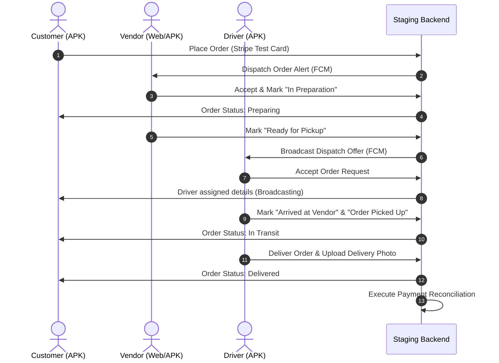

# Urban Goodz: Staging Deployment & QA Preparation Package

This document serves as the official preflight operational checklist and quality assurance specification for the staging release of **Urban Goodz**. It provides detailed instructions, configurations, and verification test suites for the current sprint lanes:
*   **Backend Integration**: `AdminPanel_Update_V39`
*   **Customer APK**: `UrbanGoodz2026-Revised`
*   **Vendor/Driver APKs**: `UrbanGoodz_Vendor_Driver_Sprint`

---

## 1. cPanel Deployment Preflight Checklist

Before starting the deployment, verify the server environment settings inside the cPanel control panel:

| Step | Item | Required Configuration / Command | Expected Value | Status |
| :--- | :--- | :--- | :--- | :--- |
| **1.1** | PHP version | cPanel -> Select PHP Version | `8.2` or `8.3` | [ ] Pending |
| **1.2** | Required PHP Extensions | `bcmath`, `ctype`, `curl`, `dom`, `fileinfo`, `gd`, `gmp`, `intl`, `json`, `mbstring`, `openssl`, `pcre`, `pdo_mysql`, `redis`, `xml`, `zip` | All enabled | [ ] Pending |
| **1.3** | PHP Memory Limit | `memory_limit` in `php.ini` | `512M` (Minimum) | [ ] Pending |
| **1.4** | Upload Size Limits | `upload_max_filesize` / `post_max_size` | `64M` / `64M` | [ ] Pending |
| **1.5** | Execution Timeout | `max_execution_time` | `120` seconds | [ ] Pending |
| **1.6** | SSL/TLS Status | cPanel -> SSL/TLS Status | AutoSSL active on domain & subdomains | [ ] Pending |
| **1.7** | Web Server Node | Apache / Litespeed Rewrite rules in `.htaccess` | Rewrite Engine `On`, redirect to `/public` | [ ] Pending |
| **1.8** | Disk Space & Inodes | cPanel -> Disk Usage | > 15% free space | [ ] Pending |

---

## 2. Required Backend Files and Directories

Ensure the following directory structure and files exist and have correct permissions on the staging server:

```
public_html/ (or domain root)
├── .env.staging                  # File permissions: 600 (Owner read-only)
├── artisan                       # File permissions: 755 (Executable)
├── bootstrap/
│   └── cache/                    # Directory permissions: 775 (Writable by group/webserver)
├── config/
├── database/
├── public/                       # Directory permissions: 755
│   ├── .htaccess                 # Standard Apache routing rules
│   ├── index.php                 # App entrypoint
│   └── storage -> ../storage/app/public # Symlink (Create via 'php artisan storage:link')
└── storage/                      # Directory permissions: 775 (Recursive)
    ├── app/
    ├── framework/
    │   ├── cache/
    │   ├── sessions/
    │   └── views/
    └── logs/
        └── laravel.log           # File permissions: 664
```

---

## 3. Database Backup & Rollback Checklist

To ensure data integrity, perform the following backup commands prior to applying migrations, and use the safer rollback guidance in the event of a migration failure.

### Pre‑Deployment Backup
1. **Log in** to cPanel Terminal or SSH.
2. **Execute the backup command**:
   ```bash
   mysqldump --opt -h localhost -u [staging_db_user] -p[staging_db_password] [staging_db_name] | gzip > ~/db_backups/urbangoodz_pre_v39_$(date +%F_%H%M%S).sql.gz
   ```
3. **Verify the backup file**:
   ```bash
   ls -lh ~/db_backups/
   # Confirm file size > 0 and integrity by checking tail
   gunzip -c ~/db_backups/urbangoodz_pre_v39_*.sql.gz | tail -n 10
   ```

### Post‑Failure Rollback Procedure (Safe)
If any migration fails or critical errors occur post‑deployment:
1. **Enable maintenance mode** (no data loss):
   ```bash
   php artisan down --secret="v39-maintenance-bypass"
   ```
2. **Restore the database** from the backup **without dropping tables**:
   ```bash
   gunzip -c ~/db_backups/urbangoodz_pre_v39_[TIMESTAMP].sql.gz | mysql -h localhost -u [staging_db_user] -p[staging_db_password] [staging_db_name]
   ```
3. **Clear caches**:
   ```bash
   php artisan cache:clear && php artisan config:clear && php artisan view:clear
   ```
4. **If a specific migration needs to be undone**, use a targeted git revert rather than a full schema wipe:
   ```bash
   git revert <migration-commit-sha>
   php artisan migrate --step
   ```
5. **Bring application back online**:
   ```bash
   php artisan up
   ```

> **Awaiting staging verification**: Verify that the backup path `~/db_backups/` exists on the staging server and that the MySQL user has the necessary privileges for import.

---

## 4. Migration Inspection Checklist

Run these steps in sequence when deploying database changes for `AdminPanel_Update_V39`:

1.  [ ] **Dry Run Inspection**: Run migrations locally first to review the generated SQL commands.
2.  [ ] **Index Verification**: Ensure all new foreign keys and query parameters (such as `order_id`, `driver_id`, `vendor_id`) have indexes to prevent staging slowdowns.
3.  [ ] **Lock Prevention**: Check that migrations do not block large production‑sized tables during peak hours (if running on shared staging setups).
4.  [ ] **Run Migrations on Staging**:
    ```bash
    php artisan migrate --force
    ```
5.  [ ] **Verify Migrations Status**:
    ```bash
    php artisan migrate:status
    ```
    *Ensure all files show `Ran: Yes`.*
6.  [ ] **Run Seeders** (Staging configuration & demo data only):
    ```bash
    php artisan db:seed --class=StagingUpdateV39Seeder
    ```

---

## 5. Required Queue Workers and Cron Jobs

Staging requires active queue processing for real‑time notifications, tracking, and stripe processing.

### cPanel Cron Job Configuration
Add the standard scheduler execution cron inside cPanel Cron Jobs:
*   **Settings**: Once per minute (`* * * * *`)
*   **Command**:
    ```bash
    /usr/local/bin/php /home/[username]/public_html/artisan schedule:run >> /dev/null 2>&1
    ```

### Staging Queue Daemon Configuration
If Supervisor is unavailable on the cPanel shared server, set up a cron job to keep the queue worker running:
*   **Settings**: Every 10 minutes (`*/10 * * * *`)
*   **Command**:
    ```bash
    /usr/local/bin/php /home/[username]/public_html/artisan queue:work --queue=high,default,notifications --stop-when-empty >> /home/[username]/public_html/storage/logs/queue.log 2>&1
    ```

---

## 6. Firebase Customer / Vendor / Driver Checklist

Ensure push notifications and authentication pathways are correctly partitioned:

- [ ] **Android Configuration File**: Verify `google-services.json` is correctly packaged inside `app/src/staging/` for both APKs.
- [ ] **iOS Configuration File**: Verify `GoogleService-Info.plist` is packaged in the runner directory for iOS builds.
- [ ] **Notification Channels**:
  - `customer-channel`: Customer status updates.
  - `vendor-channel`: New order dispatches.
  - `driver-channel`: Load board matching and transit details.
- [ ] **Firebase Cloud Messaging Key**: Staging `.env` must contain the valid `FIREBASE_CREDENTIALS` (JSON path or direct variable block) matching the staging Firebase Project.
- [ ] **Authentication**: Test SMS verification limits in the Firebase sandbox console (ensure dummy numbers are added to Firebase Auth for testing).

---

## 7. SMTP Checklist

Mail configuration validation for onboarding emails, receipt deliveries, and admin alerts:

### Environment Settings (`.env.staging`)
```ini
MAIL_MAILER=smtp
MAIL_HOST=mail.urbangoodz.co  # Or staging mail server
MAIL_PORT=465
MAIL_USERNAME=no-reply@urbangoodz.co
MAIL_PASSWORD="[STAGING_SECURE_PASSWORD]"
MAIL_ENCRYPTION=ssl
MAIL_FROM_ADDRESS="no-reply@urbangoodz.co"
MAIL_FROM_NAME="Urban Goodz (Staging)"
```

### Verification Command
Use artisan to test SMTP configuration:
```bash
php artisan mail:send info@urbangoodz.co "Staging Mail Preflight Test" "SMTP Configuration verified successfully."
```

---

## 8. Pusher / WebSocket Checklist

Real‑time location tracking and driver dispatch routing depend on WebSockets:

- [ ] **Credentials Verification**: Verify Pusher App ID, Key, Secret, and Cluster exist in `.env.staging`.
- [ ] **Authentication Endpoint**: Confirm `POST /api/broadcasting/auth` returns `200 OK` for authenticated Customer, Vendor, and Driver accounts.
- [ ] **SSL Websocket Connection**: Test connection over secure WebSocket (`wss://`).
- [ ] **Presence Channels**: Verify active presence logs inside `presence-active-drivers` for driver location updates.

---

## 9. Stripe Sandbox and Webhook Checklist

- [ ] **Stripe Keys**: Confirm `STRIPE_KEY` and `STRIPE_SECRET` point to test‑mode credentials (`pk_test_...` and `sk_test_...`).
- [ ] **Webhook Endpoint URL**: Must be registered in Stripe Developer Dashboard pointing to:
  `https://staging.urbangoodz.co/api/v1/stripe/webhook`
- [ ] **Webhook Signing Secret**: Set `STRIPE_WEBHOOK_SECRET=whsec_...` in `.env.staging`.
- [ ] **Required Webhook Events**:
  - `payment_intent.succeeded`
  - `payment_intent.payment_failed`
  - `charge.refunded`
  - `setup_intent.succeeded`

---

## 10. Maps and Tracking Checklist

- [ ] **Google Maps API Keys**: Split keys between client APKs and backend config to avoid API exposure.
- [ ] **Enabled APIs**: Ensure the following APIs are activated in the Google Cloud Platform Console for the credential:
  - Maps SDK for Android
  - Places API
  - Geocoding API
  - Distance Matrix API (Required for dispatch cost calculation)
- [ ] **HTTP/IP Restrictions**:
  - Mobile API Keys restricted by Android package names (`com.urbangoodz.customer`, `com.urbangoodz.vendor`, `com.urbangoodz.driver`).
  - Backend API Keys restricted by the staging server IP address.

---

## 11. Test Account Role Matrix

The staging database contains the following test accounts. Do not edit these credentials; use them to verify cross‑role interactions.

| Role | Username / Email | Default Password | Expected Access / Permissions |
| :--- | :--- | :--- | :--- |
| **Customer** | `customer.staging@urbangoodz.co` | `UGStaging2026!` | Search goods, make payments, update Fashion Fit profile. |
| **Vendor** | `vendor.staging@urbangoodz.co` | `UGStaging2026!` | Manage store, accept orders, dispatch preparation updates. |
| **Driver** | `driver.staging@urbangoodz.co` | `UGStaging2026!` | Accept orders, view Load Board, update coordinates, upload proof. |
| **Business** | `business.staging@urbangoodz.co` | `UGStaging2026!` | Create freight/bulk jobs on the Load Board. |
| **Dispatcher**| `dispatch.staging@urbangoodz.co` | `UGStaging2026!` | Route jobs, assign drivers manually, review active orders. |
| **Admin** | `admin.staging@urbangoodz.co` | `UGStaging2026!` | View full audit log, run payouts, resolve disputes. |

---

## 12. Core Commerce Test Script

Verify the baseline transactional flow of the platform using the Customer, Vendor, and Driver roles.



### Verification Requirements:
- Confirm Stripe transaction log shows payment status `Succeeded`.
- Confirm Driver dashboard shows wallet updates reflecting the delivery fee.
- Verify Vendor receives order payout estimation.

---

## 13. Load Board Test Script

Verify B2B bulk transportation scheduling and dispatching workflows.

1.  **Business Profile Initiation**:
    - Log in as `business.staging@urbangoodz.co`.
    - Create a Load Board Job (Specify pickup location, drop‑off location, cargo size, and payment reward).
2.  **Dispatcher Approval & Routing**:
    - Log in as `dispatch.staging@urbangoodz.co`.
    - Review the new Load Job in the Queue.
    - Match and assign the job to `driver.staging@urbangoodz.co`.
3.  **Driver Acceptance & Transport**:
    - Log in to Driver APK as `driver.staging@urbangoodz.co`.
    - View assigned loads under the "Load Board" tab.
    - Accept the job.
4.  **Completion & Payout**:
    - Simulate transport to destination coordinates.
    - Mark job as "Completed" by uploading POD (Proof of Delivery image).
    - Check Dispatcher panel to verify job is closed.
    - Log in as Admin to execute Driver payout reconciliation.

---

## 14. Fashion Fit Test Script

Verify the user profile personalization and estimation loop.

1.  **Customer Profile Setup**:
    - Log in as `customer.staging@urbangoodz.co` on the Customer APK.
    - Go to "Fashion Fit" -> Update measurements (Chest, Waist, Inseam, Height).
2.  **Provider Estimate Generation**:
    - The backend triggers a request to the Fit Match Provider mock integration.
    - Log in as Admin or Vendor. Confirm custom fit sizing options generate sizing estimates.
3.  **Acceptance & Privacy Verification**:
    - Go back to the Customer profile. Validate custom‑fit recommendation matches database records.
    - **Privacy Check**: Log in as a separate unassociated Customer account. Verify that checking another customer's profile endpoint (`/api/v1/fashion-fit/profile/[ID]`) returns `403 Forbidden` or `401 Unauthorized` to confirm data isolation.

---

## 15. Notification Matrix

Verify that events dispatch notification messages to their corresponding recipients via FCM/SMS/Email:

| Event | Recipient | Channel | Payload / Template Check | Status |
| :--- | :--- | :--- | :--- | :--- |
| **New Order Received** | Vendor | FCM Push | "New order #[ID] ready for preparation" | [ ] Pending |
| **Order Ready** | Drivers (Nearby) | FCM Broadcast | "New pickup offer near your location" | [ ] Pending |
| **Driver Assigned** | Customer | FCM & Socket | "Driver [Name] is picking up your order" | [ ] Pending |
| **Order Delivered** | Customer | Email & FCM | Receipt + "Your order has been delivered!" | [ ] Pending |
| **New Load Posted** | Dispatcher | Web Socket | "Load #[ID] awaits manual verification" | [ ] Pending |
| **Payout Processed** | Driver | Email | "Staging Payout of $[Amt] has been initiated"| [ ] Pending |

---

## 16. Defect Severity Definitions

Use these criteria during testing to classify staging errors:

### P0: Critical blocker
*   **Criteria**: System crash, data corruption, database connection failure, security vulnerability (e.g., unauthorized data access), Stripe transaction failures, or inability to install/run APKs.
*   **Resolution SLA**: Must be resolved within 4 hours. Blocks staging release.

### P1: Major deficiency
*   **Criteria**: Key application functions broken (e.g., map tracking freezes but order completes, notifications fail to send, mock payment webhook fails to fire but manually resolves). No immediate workaround.
*   **Resolution SLA**: Must be resolved before production release.

### P2: Minor bug
*   **Criteria**: Visual alignment issues, spelling errors, slow API response (> 2.5s) on non‑critical endpoints. Workarounds exist.
*   **Resolution SLA**: Scheduled for post‑release hotfix/patch.

---

## 17. Go/No-Go Release Checklist

Before pushing code to production, the staging environment must satisfy the following criteria:

- [ ] **Defect Zero Count**: Zero P0 and P1 open bugs.
- [ ] **Hash Verification**: Code matches designated deployment branches with verified commits.
- [ ] **Payment Verification**: Stripe test transactions complete successfully.
- [ ] **Load Test Profile**: Database responds under < 400ms for all read endpoints.
- [ ] **Firebase Sync**: Firebase authentication sync successfully matches dev test devices.
- [ ] **Sign‑off**: Admin panel release approved by staging release coordinator.

---

## 18. Evidence Required for Every Passing Test

The testing team must document the following proofs for each verification check:

1.  **Network Logs**: Save the HAR file or capture network inspector screenshots showing successful API return codes (`200` or `201`).
2.  **App Screenshots**: Provide visual proof showing the success banner (e.g., "Order Placed", "Sizing Updated").
3.  **Logs Output**: Provide console log snippets (`adb logcat` output or web console outputs) for any critical transitions.
4.  **Database State Snapshots**: Screenshot of the staging database schema (e.g., `orders` table showing `status = 'delivered'`) to prove state transitions.

---

## 19. Final Tester APK Installation Instructions Template

Testers must follow these steps to install the staging APK builds:

### Prerequisites
*   Android OS version 10.0 or higher.
*   Enable installation from unknown sources: `Settings -> Apps -> Special Access -> Install Unknown Apps -> Toggle ON for Files/Chrome`.

### Step‑By‑Step Installation
1.  **Download the APK**: Obtain the staging links from the secure distribution repository.
2.  **Verify File Integrity**: Calculate and verify the SHA‑256 hash using PowerShell (Windows) or Terminal (macOS):
    ```powershell
    # Windows
    CertUtil -hashfile [PATH_TO_APK] SHA256
    ```
    ```bash
    # macOS / Linux
    shasum -a 256 [PATH_TO_APK]
    ```
    *Compare value with the official build SHA list in the Release Channel.*
3.  **Sideload the Build**: Use ADB to install directly on your device:
    ```bash
    adb install -r -d [PATH_TO_APK]
    ```
4.  **Launch & Permissions Check**: Open the app and allow location permissions ("Allow all the time" for Driver APK) and notifications permissions.

---

## 20. Staging Deployment Execution Prompt

When the integrated backend Git SHA and tester APK hashes are finalized, copy and fill in this template to run the automated release workflow:

```markdown
Run Staging Deployment pipeline using the following parameters:

- Backend Git SHA: 47ce980d9a9ea6f6e806abba69e5573c03ecdca6
- Customer APK (UrbanGoodz2026-Revised) SHA-256: [INSERT_CUSTOMER_APK_SHA]
- Vendor/Driver APK (UrbanGoodz_Vendor_Driver_Sprint) SHA-256: [INSERT_VENDOR_DRIVER_APK_SHA]
- Target Server: Staging cPanel Subdomain (staging.urbangoodz.co)
- Target Staging DB Name: [INSERT_STAGING_DB_NAME]

Perform pre‑deployment checks, apply migration lane AdminPanel_Update_V39, deploy code, restart queue workers, and notify Staging QA team.
```

### Additional Placeholders for Release Artifacts
- **Customer APK source SHA**: [INSERT_CUSTOMER_APK_SOURCE_SHA]
- **Customer APK SHA‑256**: [INSERT_CUSTOMER_APK_SHA]
- **Vendor APK source SHA**: [INSERT_VENDOR_APK_SOURCE_SHA]
- **Vendor APK SHA‑256**: [INSERT_VENDOR_APK_SHA]
- **Driver APK source SHA**: [INSERT_DRIVER_APK_SOURCE_SHA]
- **Driver APK SHA‑256**: [INSERT_DRIVER_APK_SHA]
